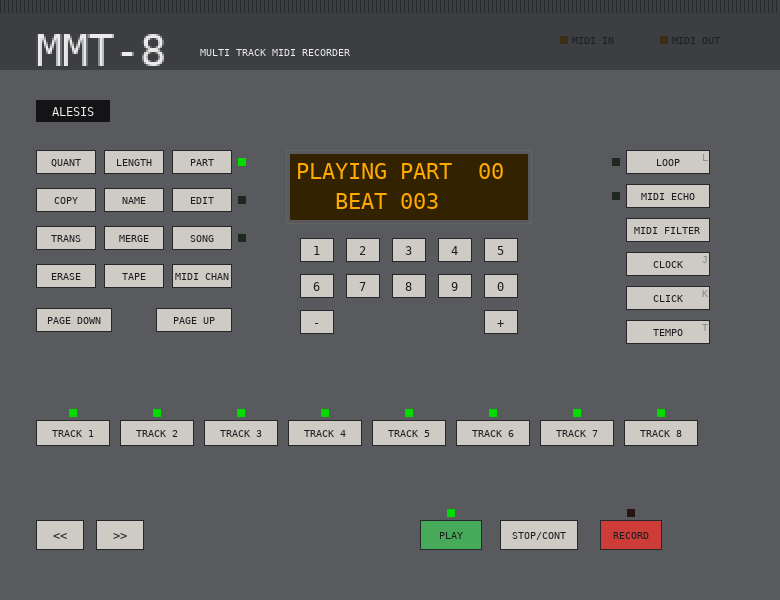

# Alesis MMT-8 Firmware Reverse Engineering

Disassembly and decompilation of the Alesis MMT-8 MIDI sequencer firmware (v1.11) for the purpose of understanding the implementation and porting to another platform — plus a **hardware simulator that runs the original firmware as a working MIDI sequencer on Linux**.

## Hardware Simulator



[`sim/`](sim/) contains a hardware-level simulator: the unmodified 32 KB EPROM
image runs on a patched [emu8051](https://github.com/jarikomppa/emu8051) core,
with the MMT-8's RAM, address decoding, I/O latches, HD44780 LCD, keyboard
matrix and UART emulated in C from the schematic. SDL2 draws the front panel
(LCD, LEDs, clickable buttons) and the MIDI IN / MIDI OUT jacks appear as ALSA
sequencer ports, so the simulated MMT-8 plugs into keyboards, synths and DAWs
like any other MIDI device.

```
sudo apt install libsdl2-dev libsdl2-ttf-dev libasound2-dev
cd sim && make && ./mmt8sim
aconnect "MMT-8 Simulator:1" "FLUID Synth:0"     # MIDI OUT -> a synth
aconnect "Keystation:0" "MMT-8 Simulator:0"      # a keyboard -> MIDI IN
```

Status: the firmware boots, passes its own RAM / EPROM / MIDI diagnostics,
records and plays back MIDI, sends MIDI clock, every button is mapped (with
keyboard shortcuts), memory persists between runs like the battery-backed
RAM, and the SysEx memory dump can be saved to and loaded from `.syx` files. A headless mode with scripted button presses, an LCD change log
and a MIDI byte trace makes it a convenient firmware-debugging rig as well.
Getting this far required fixing four instruction-semantics bugs in the
upstream emu8051 core (`MOV direct,@Ri` had its operands swapped, the auxiliary
carry flag was wrong, `XCHD` never wrote memory, `DA A` carry), now covered by
`make test`.

[`specs/mmt8/`](specs/mmt8/) is a behaviour suite written from the instruction
manual in the [panelspec](https://github.com/audiodestrukt/hexatrack) format:
physical inputs in, LCD, LEDs and MIDI out as results. `make spec` runs it
against the firmware in the simulator, and the same specs will run unchanged
against a future port through a different adapter. See
[`sim/README.md`](sim/README.md) for usage, options, the button matrix, the
LED latches, the spec suite and the design notes.

## Hardware

- **CPU**: 80C31 (8051 family, no internal ROM) @ 12 MHz crystal
- **EPROM**: U12 — 27C256 (32KB, `0x0000`–`0x7FFF`)
- **RAM**: U10, U9 — two 61256 (32KB each, 64KB total external data RAM)
- **Address Latch**: U11 — HC573 (demuxes Port 0 address/data bus)
- **Address Decoder**: U5 — HC138 (3-to-8 chip selects)
- **I/O Latches**: U8, U6, U7 — HC574 (keyboard columns, LEDs, LCD)
- **LCD**: HD44780-compatible, 2-line, 8-bit mode
- **MIDI**: UART at 31.25 kbaud via Timer 1 auto-reload

## Memory Map

| Space | Address Range | Device | Description |
|-------|--------------|--------|-------------|
| CODE | `0x0000`–`0x7FFF` | U12 27C256 EPROM | Program memory (PSEN-qualified) |
| XDATA | `0x0000`–`0x7FFF` | U10 61256 SRAM | External data RAM bank 0 |
| XDATA | `0x8000`–`0xFFFF` | U9 61256 SRAM | External data RAM bank 1 |
| IRAM | `0x00`–`0x7F` | Internal | Direct-addressable internal RAM |
| IRAM | `0x80`–`0xFF` | Internal | Indirect-only internal RAM |
| SFR | `0x80`–`0xFF` | Internal | Special Function Registers |

### XDATA Page Mapping (via P2 register)

The firmware uses P2 as a page selector for 256-byte pages in XDATA, accessed via `MOVX @R0` / `MOVX @R1`:

| P2 Value | Usage |
|----------|-------|
| 0 | MIDI TX buffer |
| 1 | MIDI RX buffer |
| 2 | Track event buffers (note on/off/CC queues) |
| 3 | Active note tracking |
| 4 | Sequence parameters and configuration |
| 5 | Song mode data and extended parameters |

### Memory-Mapped I/O Ports (XDATA via HC138 decode)

| Address | Label | Description |
|---------|-------|-------------|
| `0xFF00` | `IO_LED_CONTROL` | LED control output latch (HC574); written once at boot |
| `0xFF02` | `IO_LED_DATA` | Track LEDs 1–8 (bit n = track n+1, active low) |
| `0xFF04` | `IO_STATUS_LATCH` | Mode/transport LED latch, active low: bit 0 PLAY, 1 RECORD, 2 PART, 3 EDIT, 4 SONG, 5 MIDI ECHO, 6 LOOP |
| `0xFF06` | `IO_KEY_COLUMN_SEL` | Keyboard column select (matrix scan) |
| `0xFF08` | `LCD_CMD_DATA` | HD44780 LCD command/data register |
| `0xFF0E` | `IO_TRANSPORT_STATE` | Transport state (0=stopped, 1=playing, 2=recording) |
| `0xFF0F` | `IO_BEAT_DIVIDER` | Beat divider setting |
| `0xFF1A` | `IO_CLICK_ENABLE` | Metronome click enable |

### Keyboard Matrix

`scan_keyboard` drives six active-low column selects through the HC574 at
`0xFF06` and reads the eight rows from P1. The button positions were verified
by pressing every position in the simulator and watching the firmware respond:

| Col | Row 0 | Row 1 | Row 2 | Row 3 | Row 4 | Row 5 | Row 6 | Row 7 |
|-----|-------|-------|-------|-------|-------|-------|-------|-------|
| 0 | `<<` | `>>` | ERASE | TRANSPOSE | PLAY | STOP/CONT | COPY | RECORD |
| 1 | Track 1 | Track 2 | Track 3 | Track 4 | Track 5 | Track 6 | Track 7 | Track 8 |
| 2 | TEMPO | `-` | `+` | – | – | – | PAGE UP | PAGE DOWN |
| 3 | CLICK | 6 | 7 | 8 | 9 | 0 | MIDI CHANNEL | TAPE |
| 4 | CLOCK | 1 | 2 | 3 | 4 | 5 | SONG | MERGE |
| 5 | MIDI FILTER | MIDI ECHO | LOOP | QUANTIZE | LENGTH | PART | EDIT | NAME |

Power-on combinations checked by the reset code: ERASE + PAGE UP + PAGE DOWN
clears all memory; LOOP + QUANTIZE enters the diagnostic self-test. The three
unused positions in column 2 do nothing. Every position is pinned by the
panelspec suite in `specs/mmt8` (see the simulator README).

## Interrupt Vectors

| Vector | Address | Handler | Description |
|--------|---------|---------|-------------|
| Reset | `0x0000` | `LJMP main_init_and_loop` | Jumps to `0x00FB` |
| EXT INT0 | `0x0003` | `EXT_INT0_isr` | Increments tick counter (IRAM `0x7D`) |
| Timer 0 | `0x000B` | `TIMER0_isr` | Reloads TH0/TL0 from IRAM `0x7E`/`0x7F`, increments tick counter |
| EXT INT1 | `0x0013` | `EXT_INT1_isr` | Unused — shares RETI with Timer 0 handler |
| Timer 1 | `0x001B` | `LJMP TIMER1_isr` | Jumps to `0x76B2` |
| Serial | `0x0023` | `SERIAL_isr` | MIDI RX/TX using register banks 2 (TX) and 3 (RX) |

Note: Bytes between interrupt vectors contain ASCII padding strings (`"12345"`, `"1234567"`) — likely a version signature.

## SFR Configuration at Init

| Register | Value | Meaning |
|----------|-------|---------|
| `SP` | `0x2F` | Stack pointer (above register banks + bit-addressable area) |
| `TMOD` | `0x21` | Timer 0: mode 1 (16-bit), Timer 1: mode 2 (8-bit auto-reload) |
| `TCON` | `0x51` | Timer 0 and Timer 1 running, EXT INT0 edge-triggered |
| `SCON` | `0x70` | UART mode 1, receiver enabled |
| `IP` | `0x01` | EXT INT0 is high priority |
| `TH1`/`TL1` | `0xFF` | 31.25 kbaud MIDI baud rate (12 MHz / 12 / 32 / 1) |
| `IE` | `0x92` | Enables: EA, Timer 0, Serial |

## Firmware Architecture

The firmware is structured as a single main init + event loop in `main_init_and_loop` (`0x00FB`, ~1000 bytes). After hardware init and LCD setup, it enters a `while(1)` loop:

```
scan_keyboard()
process_midi_input()         // with register bank 2/3 context
process_midi_realtime_msgs() // external sync (clock/start/stop)
if playing:
    sequence_playback_engine()
    process_recording_realtime() or process_recording_step()
handle button events (play, stop, record, copy, delete, etc.)
update_display()
```

### Key Subsystems

1. **Timing Engine** — Timer 0 ISR + EXT INT0 provide a 96 PPQN (pulses per quarter note) sequencer clock. Timer reload values in IRAM `0x7E`/`0x7F` are computed from tempo BPM by `configure_tempo_timer` / `compute_tempo_reload`.

2. **MIDI I/O** — The Serial ISR uses 8051 register bank switching for zero-overhead context saves. Bank 2 manages the TX ring buffer, bank 3 manages RX. The P2 register (XDATA page select) is saved/restored via IRAM `0x5C`.

3. **Keyboard Scanner** — `scan_keyboard` drives a 6-column matrix via `IO_KEY_COLUMN_SEL` (`0xFF06`), reads rows from P1. Debounces by rejecting multiple simultaneous keys. Edge-detection via XOR with previous state. Auto-repeat after 0x80 ticks, then every 0x14 ticks.

4. **Sequencer Playback Engine** — `sequence_playback_engine` (`0x0AF5`, 1513 bytes) is the largest and most critical function. It iterates through all 8 tracks, reads timestamped MIDI events from XDATA, and outputs events whose timestamps match the current position. MIDI event dispatch by status byte type:
   - `< 0x7A`: Note On/Off (`0x90`/`0xB0` | channel)
   - `= 0x7A`: Program Change (`0xC0`)
   - `= 0x7B`: Channel Pressure (`0xD0`)
   - `= 0x7C`: Pitch Bend (`0xE0`)
   - `= 0x7D`: System Exclusive (`0xF0`)

5. **Recording** — Realtime (`process_recording_realtime`) and step (`process_recording_step`) modes. Incoming MIDI is timestamped with the clock counter and appended to sequence data in XDATA.

6. **Song Mode** — Chains parts into songs. `get_song_step_data` reads the song step table, `handle_song_part_change` manages transitions between parts.

7. **LCD Display** — HD44780 driver with separate screens for track mode (`display_track_mode_screen`) and song mode (`display_song_mode_screen`). Init sequence: `0x38` (8-bit/2-line), `0x06` (entry mode), `0x0E` (display on), `0x01` (clear).

8. **SysEx Dump** — `sysex_dump_engine` (598 bytes) handles bulk MIDI SysEx data transfer for backup/restore of sequence data.

9. **Self-Test** — Boot diagnostic mode activated by holding specific buttons at power-on. Tests RAM read/write (`selftest_ram_rw`), MIDI loopback, and external interrupt lines. Halts with error message on failure.

## Key IRAM Variables

| Address | Name | Description |
|---------|------|-------------|
| `0x20`–`0x25` | `key_edge_col0`–`5` | Keyboard new-keypress edge detect (6 columns) |
| `0x26`–`0x2B` | `key_scan_col0`–`5` | Current keyboard scan state |
| `0x48` | `last_button_state` | Previous button state for edge detection |
| `0x4B` | `key_repeat_timer` | Auto-repeat countdown timer |
| `0x4D`/`0x4E` | `display_ptr` | Pointer to current display string (hi/lo) |
| `0x50` | `tick_subdivider` | Tick subdivision counter (reloads from 0x60 = 96 PPQN) |
| `0x51`/`0x52` | `measure_bcd` | Current measure counter (BCD, hi/lo) |
| `0x53`/`0x54` | `total_measures` | Total measures in sequence (BCD, hi/lo) |
| `0x5C` | `saved_P2_page` | P2 backup for ISR context preservation |
| `0x6D` | `current_track_idx` | Track being processed (0–7) |
| `0x6E` | `active_track_mask` | Bitmask of tracks with data |
| `0x6F` | `track_bit_rotate` | Rotating bit for current track (1, 2, 4, ..., 128) |
| `0x70` | `track_mute_mask` | Bitmask of muted tracks |
| `0x5D`–`0x6C` | `track_ptr_table` | Eight 16-bit pointers (lo/hi) to each track's data in the current part |
| `0x71`/`0x72` | `seq_start_ptr` | Sequence data start pointer (lo/hi) in the playback engine; `0x71` also holds the selected track (1–8) outside it |
| `0x73`/`0x74` | `playback_ptr` | Current playback position pointer (lo/hi); `0x74` is reused as the record count-down beat counter |
| `0x75`/`0x76` | `record_ptr` | Current recording position pointer (hi/lo) |
| `0x77`/`0x78` | `midi_clock` | MIDI clock tick counter (hi/lo) |
| `0x7D` | `tick_counter` | Sequencer tick counter (incremented by ISRs) |
| `0x7E`/`0x7F` | `timer0_reload` | Timer 0 reload values for tempo (hi/lo) |

## Porting Considerations

Key 8051-specific idioms that will need adaptation:

1. **P2 page register** — The `MOVX @R0` / `MOVX @R1` instructions use P2 as the upper address byte to access 256-byte pages in XDATA. Replace with flat memory addressing (e.g., `xdata[page * 256 + offset]`).

2. **Register bank switching** — ISRs use `RS0`/`RS1` bits in PSW to switch between register banks 0–3 for zero-overhead context saves. Replace with normal interrupt save/restore or dedicated ISR variables.

3. **Bit-addressable variables** — Flags like `_c_0` through `_f_7` are individual bits in the 8051's bit-addressable IRAM area (`0x20`–`0x2F`). Map these to `bool` variables or bitfield structs.

4. **Timing recalibration** — Timer reload values are computed for a 12 MHz / 12 = 1 MHz timer clock. The `compute_tempo_reload` function will need recalculation for a different clock source.

5. **MIDI baud rate** — 31.25 kbaud is generated by Timer 1 auto-reload with `TH1=0xFF` at 12 MHz. Use your platform's UART peripheral configured for 31250 baud.

6. **`undefined1` / `undefined2`** — These are Ghidra placeholder types for unresolved data types. Treat `undefined1` as `uint8_t` and `undefined2` as `uint16_t` (usually a CODE or XDATA address).

## Rebuilding the Firmware

The disassembly round-trips. `firmware/mmt8.asm` is the listing as
assemblable source (as31 syntax, produced by `scripts/listing2asm.py`), and

```
make firmware      # assemble it -> build/mmt8.hex, build/mmt8.bin, byte-compare with the ROM
make roundtrip     # regenerate the source from the dis51 listing first, then the same
```

builds a 32 KB image that is byte-identical to the EPROM dump, and the
simulator boots it (`sim/mmt8sim build/mmt8.bin`). The assembler is
[as31](https://github.com/kjs452/as31), fetched and built into `tools/` by
`scripts/get-as31.sh` with a one-line fix for 64-bit hosts (its
address-overlap bitfield used a 32-bit shift). This is the path for
modifying the original firmware: edit `firmware/mmt8.asm`, `make firmware`,
run it in the simulator against the spec suite, then burn `build/mmt8.hex`.

## Repository Layout

| File | Description |
|------|-------------|
| `sim/` | Hardware simulator (see above and `sim/README.md`) |
| `firmware/alesis_mmt8_v111.bin` | Original firmware binary (32KB, 27C256 EPROM dump) |
| `firmware/alesis_mmt8_v111.hex` | Intel HEX format conversion of the binary |
| `firmware/mmt8.asm` | The disassembly as assemblable as31 source; `make firmware` rebuilds the identical ROM |
| `scripts/listing2asm.py`, `scripts/get-as31.sh` | Listing-to-source converter and the assembler bootstrap |
| `alesis_mmt8_v111.asm` | dis51 assembly listing (29,208 lines) |
| `mmt8_decompiled.c` | Annotated Ghidra decompiled C pseudocode (7,924 lines, 108 functions) |
| `mmt8_functions.txt` | Function list with addresses, sizes, and callers |
| `mmt8_callgraph.txt` | Call graph showing function relationships |
| `porting_plan.md` | Earlier plan for a source-level C port (superseded in practice by the simulator) |
| `scripts/ghidra_setup.py` | Ghidra Jython script: disassembly and function creation from entry points |
| `scripts/ghidra_annotate.py` | Ghidra Jython script: function renames, IRAM labels, I/O labels, comments |
| `scripts/ghidra_export.py` | Ghidra Jython script: exports decompiled C, function list, call graph |
| `ghidra_project/` | Ghidra project directory (open in Ghidra GUI for interactive analysis) |

Note that some function and variable names in the decompiled output are early
guesses; the simulator has since shown that e.g. `advance_playback_position`
(`0x0824`) is really the end-of-recording finalisation and `sequence_data_seek`
(`0x1A3B`) is a 16-bit block copy.

## Reference Documents

| File | Description |
|------|-------------|
| `Alesis MMT-8 Schematic.pdf` | Circuit schematic (MMTPCB, 1987) |
| `Alesis MMT-8 Service Manual.pdf` | Service manual |
| `Alesis MMT-8 Instruction Manual.pdf` | User manual |
| `Alesis MMT-8 DC battery power mod.pdf` | Battery power modification |

## Tools Used

- **dis51** — 8051 hex file disassembler (initial disassembly with code flow analysis)
- **Ghidra 12.0** — Headless analysis, decompilation, and annotation via Jython scripts
- **objcopy** — Binary to Intel HEX format conversion
- **emu8051** (patched), **SDL2**, **ALSA** — the simulator
